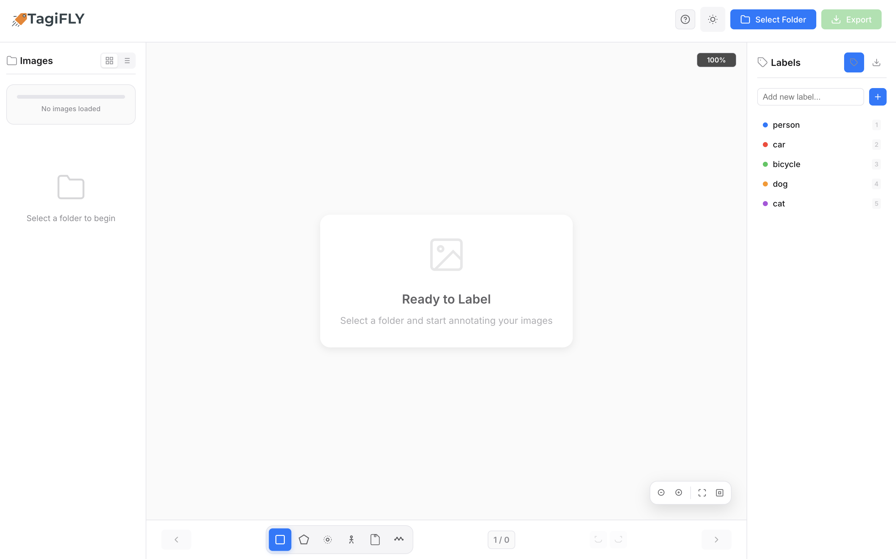
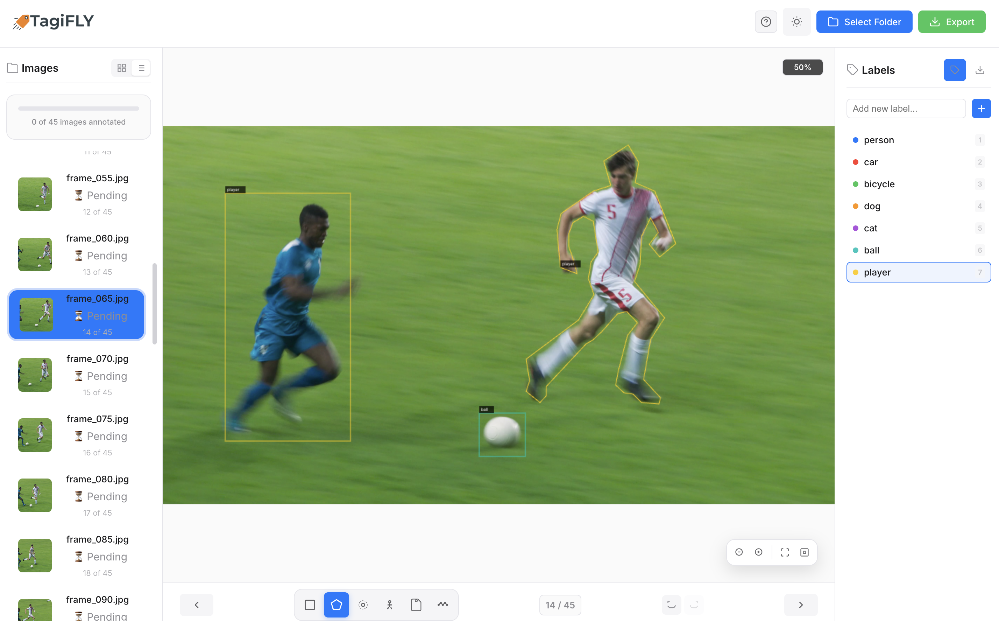
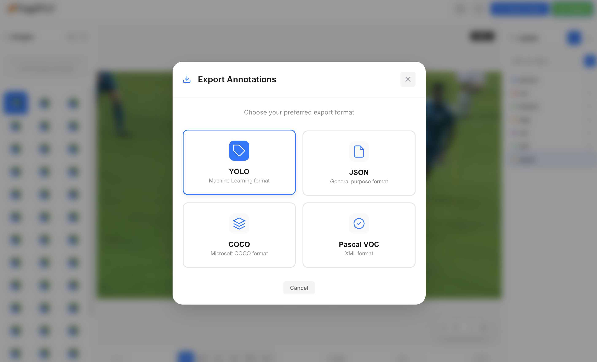
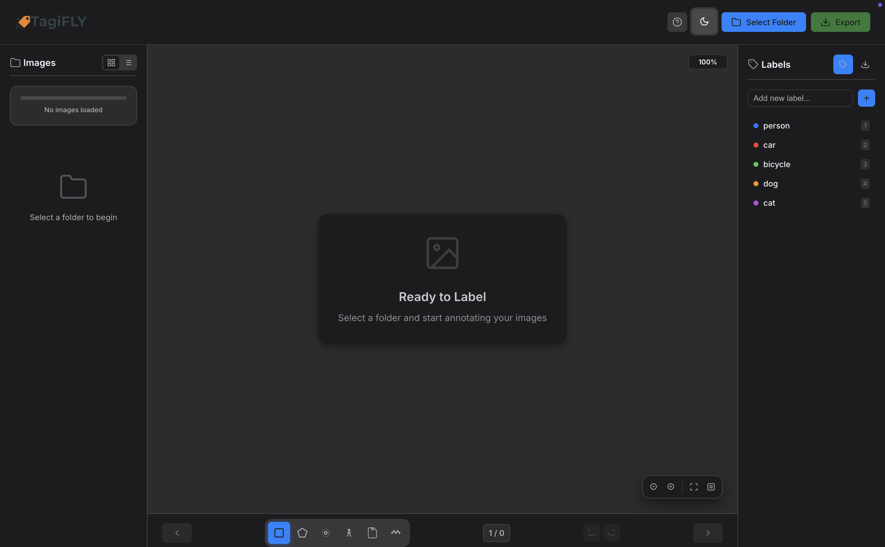
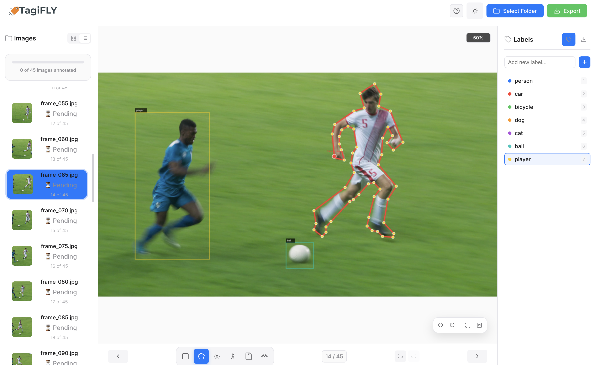

# TagiFLY v2.0.0 🚀

**Professional AI Labelling Tool for Computer Vision**

[](https://opensource.org/licenses/MIT)
[](https://electronjs.org/)
[](https://github.com/dvtlab/tagifly)

Open source, lightweight, and focused only on what you need.
> **TagiFLY v2.0.0** is a cross-platform desktop application for AI computer vision data labeling.

## 📸 Screenshots

| Main Screen | Annotation Example |
|-------------|---------------------|
|  |  |

| Export Window | Dark Mode | Light Mode |
|---------------|-----------|------------|
|  |  |  |

## ✨ Features

### 🎯 **Annotation Tools**
- **Bounding Box**: Rectangle annotations for object detection
- **Polygon**: Complex shape annotations with precise boundaries
- **Point**: Single point annotations for key features
- **Keypoint/Pose**: 17-point human pose estimation annotations
- **Mask Paint**: Brush-based segmentation annotations
- **Polyline**: Line and path annotations
### 📤 **Multiple Export Formats**
- **JSON**: General-purpose format with full metadata
- **YOLO**: Machine learning format for object detection
- **COCO**: Microsoft COCO dataset format
- **Pascal VOC**: XML format for computer vision
### 🔧 **Advanced Features**
- **Label Management**: Export/import label configurations
- **Performance Optimized**: Cached rendering and smooth interactions
- **Cross-Platform**: Windows, macOS, and Linux support
- **Professional Canvas**: High-performance image rendering
## ⚠️ Note 
This is the **second release **.  
It may contain bugs or missing features. Please share your feedback so we can improve it together. 🚀  

## 🚀 Quick Start
### Prerequisites
- Node.js 16+ 
- npm or yarn

### Installation
1. **Clone the repository**
   ```bash
   git clone https://github.com/dvtlab/tagifly.git
   cd tagifly
   ```
2. **Install dependencies**
   ```bash
   npm install
   ```
3. **Start the application**
   ```bash
   npm start
   ```
## 📖 User Guide

### Getting Started

1. **Select Folder**: Click "Select Folder" to load your images
2. **Choose Annotation Tool**: Select from 6 professional annotation tools
3. **Add Labels**: Create custom labels or use predefined ones
4. **Annotate**: Click and drag to create annotations
5. **Export**: Choose from 4 export formats (JSON, YOLO, COCO, Pascal VOC)

### Keyboard Shortcuts

| Shortcut | Action |
|----------|--------|
| `B` | Bounding Box tool |
| `P` | Polygon tool |
| `O` | Point tool |
| `K` | Keypoint/Pose tool |
| `M` | Mask Paint tool |
| `L` | Polyline tool |
| `F` | Fit to screen |
| `1-9` | Quick label assignment |
| `Ctrl+Z` | Undo |
| `Ctrl+Y` | Redo |
| `Delete` | Remove selected annotation |
| `ESC` | Cancel current operation |


## 🆕 What's New in v2.0.0

### 🎯 **Revolutionary Improvements**

#### **🎨 User Experience Revolution**
- **✨ Smart Notifications**: Moved to center header - no more UI blocking
- **✨ Dark Mode Perfection**: Fixed invisible text in input fields and zoom indicators
- **✨ Keyboard Harmony**: Resolved all conflicts between shortcuts and input fields
- **✨ Zoom Mastery**: Fixed centering issues - zoom now works like Photoshop
- **✨ Pose Guidance**: Step-by-step instructions for 17-point human pose annotation
#### **🔄 Annotation Tools Enhancement**
- **🎯 Keypoint/Pose Selection**: Fixed drag and move - now works flawlessly
- **🎯 Mask Paint Selection**: Added proper selection handling for brush strokes
- **🎯 ESC Key Intelligence**: Enhanced pose drawing cancellation with cleanup
- **🎯 Universal Undo/Redo**: Fixed for all annotation types - never lose work again
#### **📤 Brand New Label Management**
- **🆕 Label Export/Import**: Save your label configurations as JSON files
- **🆕 Professional Tab System**: Two-tab interface (Labels & Import/Export)
- **🆕 Smart Statistics**: Real-time label count and last updated tracking
- **🆕 Duplicate Prevention**: Intelligent merging during label import
- **🆕 Workflow Continuity**: Continue projects across sessions
#### **⚡ Performance Breakthrough**
- **🚀 Memory Optimization**: Advanced caching for smooth performance
- **🚀 Animation Smoothness**: Enhanced UI transitions and interactions
- **🚀 Error Resilience**: Robust error handling throughout the application

## 📄 License
This project is licensed under the MIT License - see the [LICENSE](LICENSE) file for details.

<div align="center">

## 👨‍💻 Author

**TagiFLY v2.0.0** - Labelling Tool for AI Computer Vision 🚀

⭐ If TagiFLY helps you, don’t forget to leave a star!  

Made with 💙 by dvtlab  

📧 Contact: dvtlab@outlook.com  

</div>
